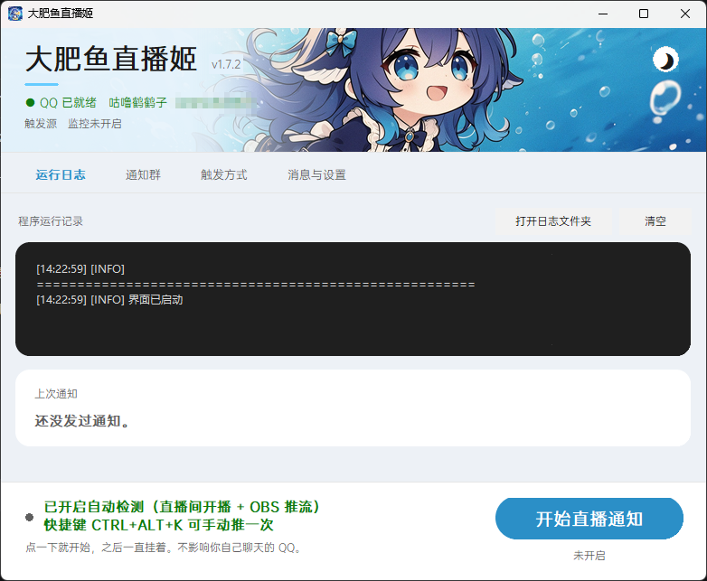

# 大肥鱼直播姬


[](https://github.com/KagurazakaChizuru/dafeiyu-live-notify/releases/latest)
[](LICENSE)
[](#)
[](#)
[](#)

**你开播时，它自动往 QQ 群发一条 `@全体成员`，顺便告诉群友你正在玩什么。**
不需要点任何按钮，挂着就行；下播时再发一条。

### ⬇️ [点这里下载最新版](https://github.com/KagurazakaChizuru/dafeiyu-live-notify/releases/latest)

**不会用 GitHub 的走夸克网盘** —— 那份包里连 NapCat 都带好了，解压双击 exe 就能用：

> ### 🐟 [夸克网盘下载](https://pan.quark.cn/s/f9e93b942495)

Windows 10 / 11 · 免安装 · 不用装 Python · 解压就能跑

也可以让包管理器装：

```powershell
# Scoop（现在就能用）
scoop bucket add dafeiyu https://github.com/KagurazakaChizuru/dafeiyu-live-notify
scoop install dafeiyu/dafeiyu-live-notify

```

> **winget 不做了**（2026-09-21 决定）：往微软社区仓库提清单，意味着每次发版都要
> 对齐版本号、URL 和 sha256，收益不抵这份工。装法就是上面那条 Scoop，或者直接下 zip。



界面配色是照着二次元的调子做的：天依蓝、圆角、一点回弹动效。
**顶部那条头图可以换成你自己的** —— 往 `app\` 里丢一对
`header-light.png` / `header-dark.png`（780 × 138）就生效，不用重新打包。

---

## 它替你解决什么

**「今天播什么？」——群里问的人比你以为的多。**
光发一句「开播了」没什么说服力。通知里写清楚在玩什么、附上直播间封面，
来的人才多。

**「打开直播软件」不等于「开播」。**
你还要调设备、试麦、试妆，这段时间不该打扰群友。所以触发的依据是
**直播间真的开了**，而不是「OBS 启动了」。

---

## 它能做什么

| | |
|---|---|
| 🔔 **开播自动通知** | 多群同时发 `@全体成员`，附一张直播间封面小图 |
| 🎮 **自动识别在玩什么** | 通知里写「正在玩《三角洲》」。看当前窗口和你自己的直播姬场景配置，**不截图、不上传任何画面** |
| 📝 **13 套文案自动轮换** | 内置一池子文案，每次开播随机挑一条。群里刷到第三遍就自动忽略 —— 换着发才有人看。想自己写就往里添 |
| ⏰ **开播后二次提醒** | 30 分 / 1 小时各补一条，给第一波没看到的人第二次机会。有硬性条数上限，刷不爆 |
| 🌙 **下播提示** | 附本次直播时长和人气峰值。默认不 @ 任何人 |
| 👀 **UP 主发新视频 / 新动态也通知** | 填个 UID 就行，提醒带一张封面缩略图。投稿不用登录；动态要扫码登录一次（**界面里点一下，不用抄 cookie**）。**首次订阅不补发历史，同一条只发一次** |
| 🧪 **测试窗口** | 点一下就能看见每类通知此刻长什么样，「换一批」翻文案 —— 一条都不会发出去 |
| 💬 **群里能和它说话** | @ 它就回话，还能替你记提醒（「提醒我 21:30 交作业」）。默认走**本机小模型**，不花 API 额度；它**没有工具** —— 翻文件、执行命令都做不到 |
| 🎯 **四种触发方式** | 直播间轮询 / OBS 推流事件 / 全局快捷键 / UP 主新投稿，可多选，共用冷却 |
| 🙈 **不占用你自己的 QQ** | 独立 QQ 副本实现双实例共存，通知器挂着时你照常聊天 |
| 📦 **绿色免安装 · 零依赖** | 单文件 exe（内置 Python），只用标准库 + tkinter |
| 🔒 **隐私友好** | 不登录、不用 Cookie、聊天内容不落盘。群聊默认只发给**本机模型**（`127.0.0.1:11434`），只有把后端换成 DSH 才会出网 |

> ⚠️ 程序的外部网络请求都在 B站，读的都是**公开数据**：
> 开启「直播间开播时通知」后定期读你自己直播间的开播状态；开启订阅后定期读
> 你订阅的 UP 主的投稿列表。这两条**不登录、不带 Cookie、不携带任何身份信息**。
> 只有「也通知动态」需要一次登录态（B站的动态接口匿名读不到，实测连官方账号
> 也一样）—— 界面里「登录 B站（扫码）」扫一下就有，**不需要抄 cookie，也不会
> 去读你浏览器的 cookie**。那个值只存在你自己的 `app\config.json` 里，
> 日志里打码，打出来的 zip 会拒绝包含它的文件。全部默认直连不走代理。介意就关掉，
> 其余触发源完全在本地工作。

---

## 快速开始

### 方式一：下打包好的（推荐，不需要装 Python）

**[⬇ 最新版本](https://github.com/KagurazakaChizuru/dafeiyu-live-notify/releases/latest)**

解开 zip → 双击 `大肥鱼直播姬.exe` → 点那个大蓝按钮。

包里带好了 exe（内含 Python 运行时）和全部文档。**还差两步要你自己做**
（原因见下方[许可证](#许可证)）：

1. 下 [NapCat](https://github.com/NapNeko/NapCatQQ/releases) 的 `NapCat.Shell.zip`，
   解压到 `app\napcat\`
2. 在 `app\` 里跑一次 `_setup-qq-copy.ps1` —— 它从你已装的 QQ 生成那个
   「私有副本」（约 7 MB，不是 1.1 GB）

> NapCat 和 QQ 本体都不在包里：前者让你自己下最新版，后者是腾讯的专有软件，
> 公开分发属于侵权。第 2 步在你自己机器上生成，既是合法问题也是体积问题。

### 方式二：从源码跑

```bash
git clone https://github.com/KagurazakaChizuru/dafeiyu-live-notify.git
cd dafeiyu-live-notify
copy config.example.json config.json
copy _account.txt.example _account.txt
python live_notify.py check     # 自检，它会告诉你还缺什么
python gui.py                   # 打开界面
```

需要 Python 3.8+，**不需要装任何第三方库**。

界面怎么读、出问题怎么办，看 **[使用文档](docs/使用文档.md)**。

---

## 文档

| 文档 | 写给谁 | 内容 |
|---|---|---|
| **[使用文档](docs/使用文档.md)** | 用这个工具的人 | 怎么装、怎么配、界面怎么读、坏了怎么办 |
| **[技术文档](docs/技术文档.md)** | 想读懂设计的人 | 架构分层、触发语义矩阵、接口规格、配置 Schema，以及实现中实际踩到的陷阱 |
| **[开发文档](docs/开发文档.md)** | 要改代码的人 | 代码地图、必须遵守的工程约定、调试手段、扩展指南、打包发版 |
| **[更新记录](CHANGELOG.md)** | 所有人 | 每个版本改了什么 |

---

## 命令行

图形界面之外，核心逻辑也能单独跑：

```bash
python live_notify.py check     # 自检：配置 / NapCat 连通性 / 群权限
python live_notify.py test      # 彩排：打印将要发送的内容，不真发
python live_notify.py send      # 立即发送一次
python live_notify.py watch     # 常驻监控（默认）
python live_notify.py groups    # 列出机器人所在的所有群
```

---

## 常见问题

**Q：开了通知器，我的 QQ 会掉线吗？**
不会。程序跑在一份独立的 QQ 副本上，是第二个互不干扰的实例。

**Q：群里的 `@全体成员` 没提醒到人？**
机器人不是群主 / 管理员。跑 `python live_notify.py check` 会告诉你是哪个群，
改成「@指定人」再填 QQ 号即可。

**Q：我用直播姬 / 直播伴侣，也能自动检测吗？**
能。走「直播间开播时通知」那条路，它不看你用什么软件 —— 手机开播同样认。
只有「OBS 推流事件」需要 OBS 自带 websocket，直播姬虽然是 OBS 内核但没带。

**Q：游戏名认错了怎么办？**
「消息与设置」页有个「测试一下现在认成什么」按钮，开个游戏点一下就知道。
认错了把它填进「不算游戏的」框里，或者在 `game.names` 里写死映射。

**Q：群里 @ 了机器人，它不回？**
先看「运行日志」标签页收到那条消息没有。三种常见原因：群聊开关没开（`chat.enabled`）、
本机模型没在跑（`ollama list` 看一眼）、或者同一个人 20 秒内又问了一次（冷却）。
它不理人的时候**不报错**，日志是唯一线索。

**Q：它答得太慢 / 太笨？**
`chat.local_model` 换个模型就行：图快用 `qwen2.5:1.5b`（约 1 GB），图聪明用 `qwen2.5:7b`。
先 `ollama pull <模型名>` 拉下来再改配置。

**Q：会不会泄露我的聊天记录？**
程序只跟 `127.0.0.1:3000` 通信，聊天内容不落盘，没有任何外部上报。
游戏识别同样只在本地读窗口标题和直播姬 / OBS 的场景文件，不截图、不上传。

---

## 许可证

- **本项目代码**：MIT（见 [`LICENSE`](LICENSE)）
- **NapCat**：采用 [Limited Redistribution License](https://github.com/NapNeko/NapCatQQ/blob/main/LICENSE) ——
  允许再分发（需附许可证全文并注明来源），**禁止商业用途**。
  本仓库不打包 NapCat，请自行从官方 Releases 下载。
- **QQ 本体**：腾讯专有软件。**任何情况下都不要把 QQ 的程序文件提交到公开仓库**，
  这属于侵权，会被 DMCA 下架。

---

## 致谢

- [NapCatQQ](https://github.com/NapNeko/NapCatQQ) —— QQ 协议端
- [OneBot v11](https://github.com/botuniverse/onebot-11) —— 通信协议
- [obs-websocket](https://github.com/obsproject/obs-websocket) —— OBS 事件来源
